## Gait cycle

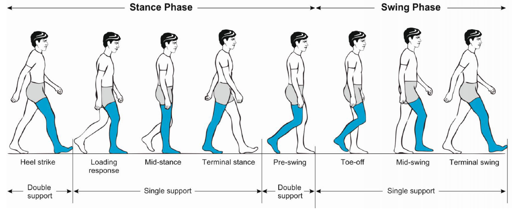


## Gait cycle

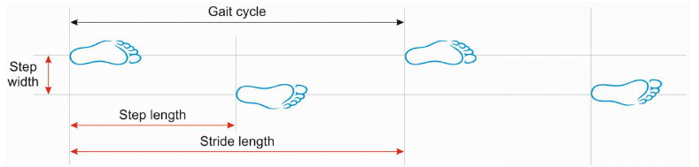

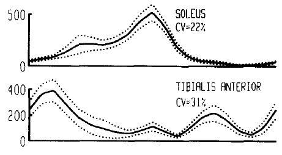

## Control of gait

- How CNS continuously adjusts control of walking over the gait cycle to ensure stable movement

```{r c1, echo=FALSE, cache=FALSE, out.width = '75%'}
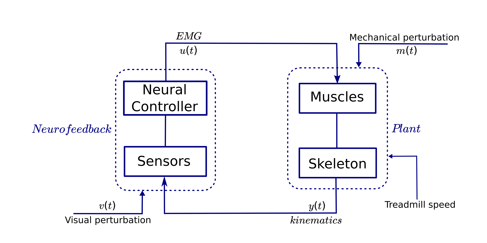
```

- Muscle activations & speed
- Small adjustments

## Problem statement

&nbsp;

- How do small changes in speed affect modulations of muscle activations?

## System identification

- Application of perturbations
    * Cause and effect relationship
- Joint input-output method
    * $T_{vy} = P T_{vu}$ ; $T_{mu} = F T_{my}$
- Short latency inference

```{r c3, echo=FALSE, cache=FALSE, out.width = '75%'}

```

## LTP systems and HTFs

&nbsp;

```{r c5, echo=FALSE, cache=FALSE, out.width = '30%'}
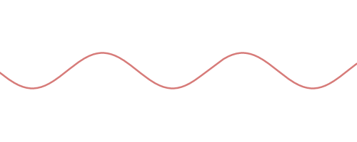
```
```{r c6, echo=FALSE, cache=FALSE, out.width = '26%'}

```
```{r c7, echo=FALSE, cache=FALSE, out.width = '30%'}
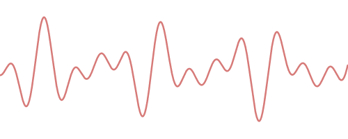
```

- For walking frequency  $f_0$ , the $k-th$ mode of HTF describes how input at frequency  $f$  is mapped to output at frequency $f +kf_0$

- Each mode of the HTF is described by its own gain and phase functions.

## Phase-dependent IRF (φIRF)
```{r c8, echo=FALSE, cache=TRUE, message=FALSE, warning=FALSE}

require(colorRamps)
require(colorspace)
require(plotly)

setwd("/home/feri/Documents/0PhD/Data/VSP_m")

airt <- vector("list", 4)

airt[[1]] <- read.csv("airf1_t.csv", header = FALSE)
airt[[2]] <- read.csv("airf2_t.csv", header = FALSE)  # averaged IRFs for all phases of stimulus (not just one slice)
airt[[3]] <- read.csv("airf3_t.csv", header = FALSE) 
airt[[4]] <- read.csv("airf4_t.csv", header = FALSE)

mdf <- read.csv("mdf.csv", header = FALSE, stringsAsFactors = FALSE)
toff <- trunc(mean(mdf[,1])*10^3)/10^3 

cont <- lapply(airt, as.matrix)
qmin <- -0.5 + toff -0.5
qmax <- 1
q1 <- as.data.frame(seq(qmin, toff, length.out = dim(cont[[2]])[1]))
q2p <- as.data.frame(seq(qmin, qmax, length.out = dim(cont[[2]])[2]))

qq1 <- as.numeric(unlist(q1))
qq2p <- as.numeric(unlist(q2p))

IRF <- as.matrix(airt[[2]])

plot_ly(x = rev(qq2p), y = qq1, z = IRF, type = "surface", opacity = 1, colors = diverge_hcl(121, c = 120, l = c(20,90), power = 1.0)) %>%
  layout(scene = list(
      xaxis = list(title = "Normalized response time"),
      yaxis = list(title = "Perturbation phase"),
      zaxis = list(title = "IRF")
    ))

```

##

```{r c9, echo=FALSE, cache=FALSE, out.width = '50%'}
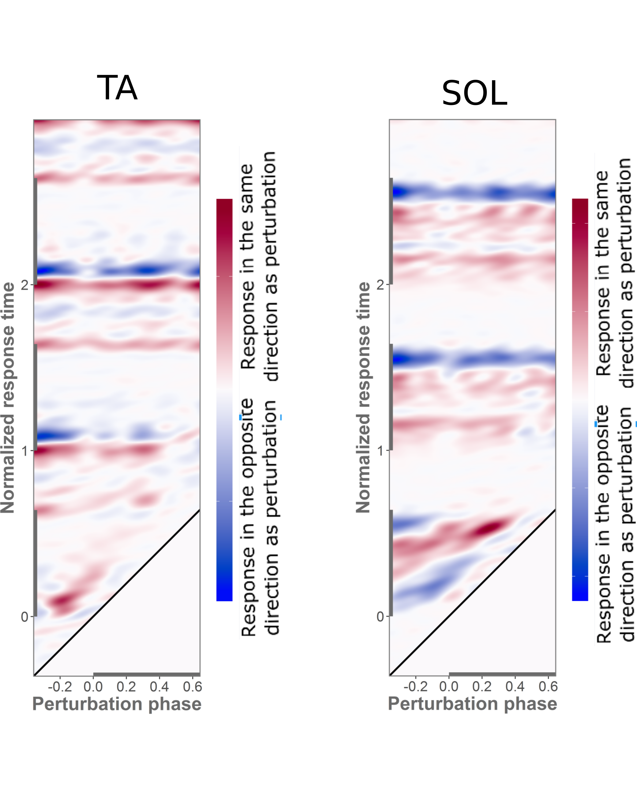
```

##

```{r c10, echo=FALSE, cache=FALSE, out.width = '55%'}
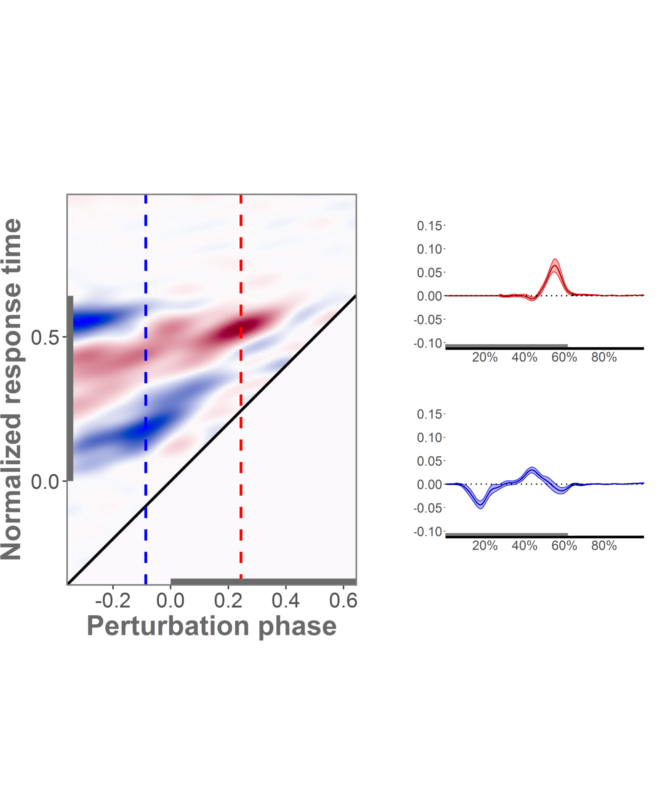
```

## Mechanical perturbations of treadmill speed

- How do small changes in treadmill speed affect kinematic responses and modulations of muscle activations?

```{r c20, echo=FALSE, cache=FALSE, out.width = '75%'}

```

## Methods

- Perturbations of treadmill belt (filtered white noise)

- Average speed: 1.3 m/s

- 15 subjects

- 2 perturbation amplitudes

- 8 randomized trials 

- EMG from 14 muscles

## Results

Single-support kinematics

```{r c21, echo=FALSE, cache=FALSE, out.width = '85%'}
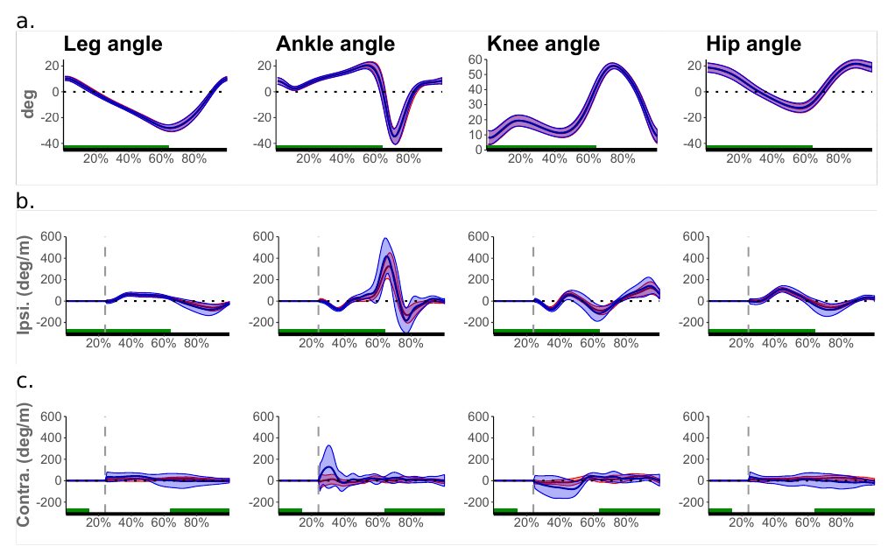
```

## single-support EMG

```{r c22, echo=FALSE, cache=FALSE, out.width = '90%'}
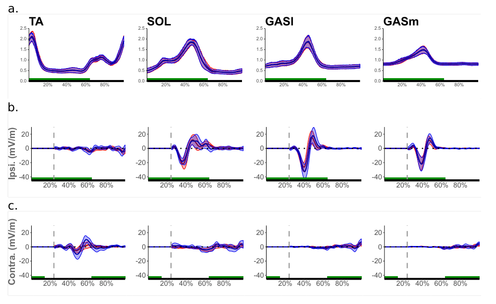
```

## double-support kinematics

```{r c23, echo=FALSE, cache=FALSE, out.width = '90%'}
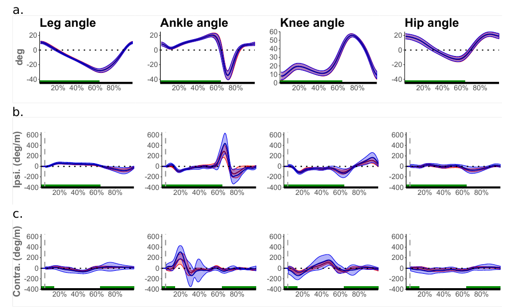
```

## double-support EMG

```{r c24, echo=FALSE, cache=FALSE, out.width = '90%'}
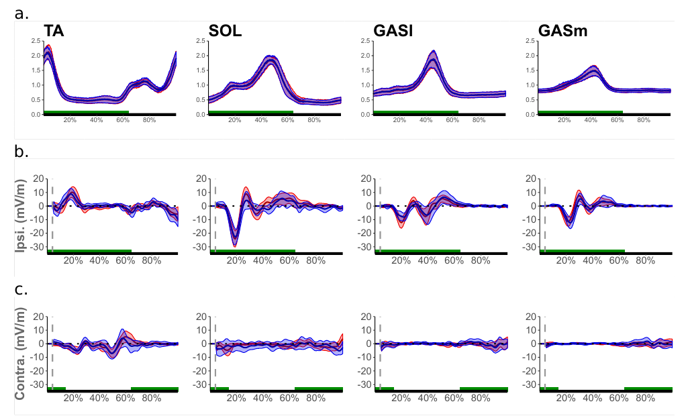
```

## Discussion

&nbsp;

- Both kinematic and EMG responses

- Single-support and double-support responses

- Responses in all leg muscles for both amplitudes

- Assumption of local limit cycle based on amplitude analysis

## Take-away messages

&nbsp;

- Responses to small continuous perturbations

- Effect of amplitude


